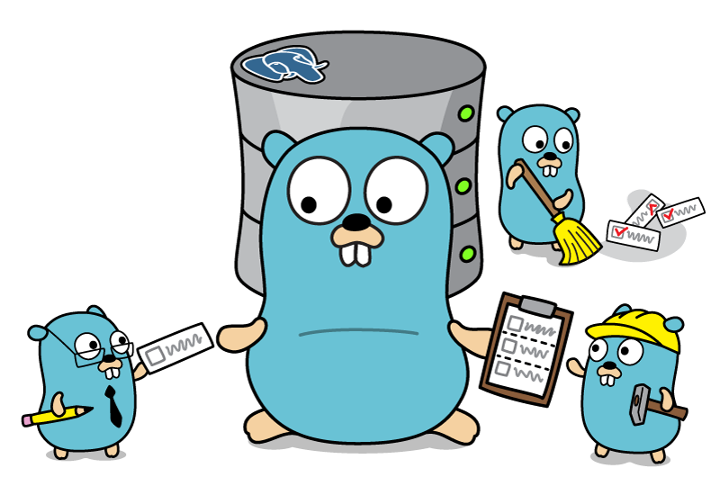

[![godoc for greencoda/tasq][godoc-badge]][godoc-url]
[![Build Status][actions-badge]][actions-url]
[![Go 1.19][goversion-badge]][goversion-url]
[![Go Report card][goreportcard-badge]][goreportcard-url]

<p align="center"></p>

# tasq

Tasq is Golang task queue using SQL database for persistence.
Currently supports: 
- PostgreSQL
- MySQL

## Install

```shell
go get -u github.com/greencoda/tasq
```

## Usage Example

To try tasq locally, you'll need a local DB running on your machine. You may use the supplied docker-compose.yml file to start a local instance
```shell
docker-compose -f _examples/<example_repo_name>/docker-compose.yml up -d
```

Afterwards simply run the example.go file
```shell
go run _examples/<example_repo_name>/main.go
```

[godoc-badge]: https://pkg.go.dev/badge/github.com/greencoda/tasq
[godoc-url]: https://pkg.go.dev/github.com/greencoda/tasq
[actions-badge]: https://github.com/greencoda/tasq/actions/workflows/test.yml/badge.svg
[actions-url]: https://github.com/greencoda/tasq/actions/workflows/test.yml
[goversion-badge]: https://img.shields.io/badge/Go-1.19-%2300ADD8?logo=go
[goversion-url]: https://golang.org/doc/go1.19
[goreportcard-badge]: https://goreportcard.com/badge/github.com/greencoda/tasq
[goreportcard-url]: https://goreportcard.com/report/github.com/greencoda/tasq
